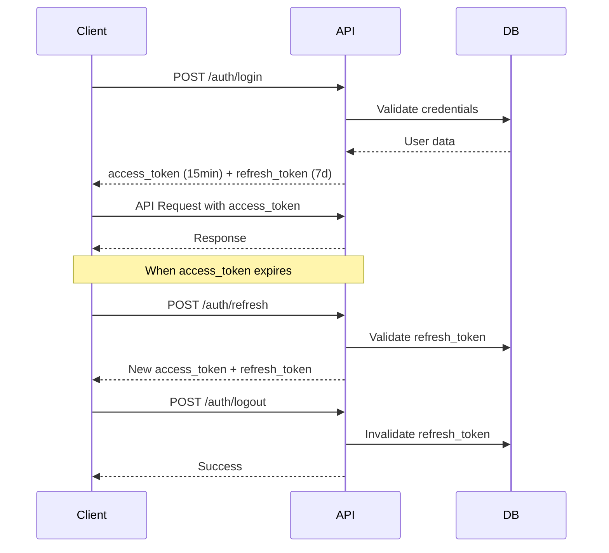

# Blog RESTful API (NestJS + TypeORM + Role System)

A comprehensive blog management API built with NestJS, TypeORM, and PostgreSQL featuring role-based access control (RBAC), JWT authentication with refresh tokens, and email verification.

## 🚀 Features

### Authentication & Authorization
- **JWT Authentication** with access tokens (15min) and refresh tokens (7 days)
- **Token Rotation** for enhanced security
- **Role-Based Access Control (RBAC)** with three roles:
  - `SUPER_ADMIN`: Full system access
  - `USER`: Can create/edit posts and manage own profile
  - `READ_ONLY`: Can only read posts and view own profile
- **Email Verification** (configurable via environment variables)
- **Google OAuth 2.0** integration
- **Secure Logout** with token invalidation

### Blog Management
- **CRUD Operations** for blog posts
- **Advanced Filtering** (by project, language, category, author)
- **Search Functionality** in post titles
- **Pagination** with customizable limits
- **Sorting** by any field (ascending/descending)
- **Rich Content Blocks** with HTML support
- **SEO Optimization** fields
- **Multi-language Support**

### Security & Performance
- **Rate Limiting** with @nestjs/throttler
- **Input Validation** with class-validator
- **Password Hashing** with bcrypt
- **CORS Configuration**
- **Global Response Interceptor**
- **Comprehensive Error Handling**

## 🏗️ Architecture

### Role System Overview

The API implements a three-tier role system:

#### SUPER_ADMIN
- View all users in the system
- Update any user's role
- Delete any user (except themselves)
- Full access to all posts operations
- Can view and edit any user profile

#### USER
- Create, read, update, delete posts
- Manage own profile only
- Cannot access other users' data
- Cannot change roles

#### READ_ONLY
- Read posts only (all public endpoints)
- View own profile only
- Cannot create, update, or delete posts
- Cannot access other users' data

### Authentication Flow



## 🛠️ Installation & Setup

### Prerequisites
- Node.js (v18 or higher)
- PostgreSQL (v12 or higher)
- npm or yarn

### 1. Clone the Repository
```bash
git clone <repository-url>
cd blog-restful-api
```

### 2. Install Dependencies
    ```bash
    npm install
    ```

### 3. Environment Configuration
Create a `.env` file in the root directory:

```env
# Server Configuration
PORT=3000
API_PREFIX=api/v1

# Database Configuration
DB_HOST=localhost
DB_PORT=5432
DB_USERNAME=postgres
DB_PASSWORD=your_password
DB_NAME=blog_db

# JWT Configuration
JWT_SECRET=your_jwt_secret_key_here
JWT_EXPIRES_IN=15m
JWT_REFRESH_SECRET=your_jwt_refresh_secret_key_here
JWT_REFRESH_EXPIRES_IN=7d

# Email Verification (set to 'true' to require email verification)
REQUIRE_EMAIL_VERIFICATION=false

# Google OAuth (optional)
GOOGLE_CLIENT_ID=your_google_client_id
GOOGLE_CLIENT_SECRET=your_google_client_secret
FRONTEND_URL=http://localhost:3000

# Admin Seeder Configuration (recommended for production)
ADMIN_EMAIL=your_admin@domain.com
ADMIN_PASSWORD=your_secure_admin_password
ADMIN_FIRST_NAME=Your_FirstName
ADMIN_LAST_NAME=Your_LastName
```

### 4. Database Setup
    ```bash
# Create PostgreSQL database
createdb blog_db

# Run the application (TypeORM will auto-sync tables)
    npm run start:dev
    ```

### 5. Default Admin User
The system automatically creates a default SUPER_ADMIN user on startup. For security reasons, these credentials are now configurable via environment variables:

#### Environment Variables (required for production):
```env
# Admin Seeder Configuration
ADMIN_EMAIL=your_admin@domain.com
ADMIN_PASSWORD=your_secure_admin_password
ADMIN_FIRST_NAME=Your_FirstName
ADMIN_LAST_NAME=Your_LastName
```

#### Default Values (development only):
- **Email**: `admin@blog.com`
- **Password**: `your_secure_admin_password`
- **Role**: `SUPER_ADMIN`

**⚠️ Security Note**: 
- Always set custom admin credentials via environment variables for production
- Never commit your actual admin credentials to version control
- Use strong passwords for admin accounts

## 📚 API Documentation

### Base URL
```
http://localhost:3000/api/v1
```

### Authentication Endpoints

#### Register User
```http
POST /auth/register
Content-Type: application/json

{
  "email": "user@example.com",
  "firstName": "John",
  "lastName": "Doe",
  "password": "password123"
}
```

#### Login
```http
POST /auth/login
Content-Type: application/json

{
  "email": "admin@blog.com",
  "password": "admin123"
}
```

**Response:**
```json
{
  "status": "SUCCESS",
  "data": {
    "access_token": "eyJhbGciOiJIUzI1NiIs...",
    "refresh_token": "fe0e56773ab46f875ad8aa69c0c5f9d3...",
    "user": {
      "id": "5d26505d-beb5-4625-b3d1-118f01b6ff8d",
      "email": "admin@blog.com",
      "first_name": "Super",
      "last_name": "Admin",
      "role": "SUPER_ADMIN",
      "is_email_verified": true,
      "created_at": "2025-05-26T06:36:02.599Z",
      "updated_at": "2025-05-26T06:36:02.660Z"
    }
  }
}
```

#### Refresh Token
```http
POST /auth/refresh
Content-Type: application/json

{
  "refresh_token": "your_refresh_token_here"
}
```

#### Logout
```http
POST /auth/logout
Content-Type: application/json

{
  "refresh_token": "your_refresh_token_here"
}
```

### Role Management (SUPER_ADMIN Only)

#### Get All Users
```http
GET /auth/users
Authorization: Bearer your_access_token
```

#### Update User Role
```http
PATCH /auth/users/{userId}/role
Authorization: Bearer your_access_token
Content-Type: application/json

{
  "role": "READ_ONLY"
}
```

### Posts Endpoints

#### Create Post (USER, SUPER_ADMIN)
```http
POST /posts
Authorization: Bearer your_access_token
Content-Type: application/json

{
  "title": "My Blog Post",
  "slug": "my-blog-post",
  "projectIdentifier": "my-blog",
  "contentBlocks": [
    {
      "order": 0,
      "content": "<p>This is the content of my post.</p>"
    }
  ],
  "categories": ["Technology"],
  "authors": ["John Doe"],
  "language": "en"
}
```

#### Get All Posts (Public)
```http
GET /posts?page=1&limit=10&sort=-created_at&projectIdentifier=my-blog&lang=en
```

#### Update Post (USER, SUPER_ADMIN)
```http
PATCH /posts/{postId}
Authorization: Bearer your_access_token
Content-Type: application/json

{
  "title": "Updated Title",
  "categories": ["Technology", "Updated"]
}
```

#### Delete Post (USER, SUPER_ADMIN)
```http
DELETE /posts/{postId}
Authorization: Bearer your_access_token
```

## 🎯 Real-World Usage Scenarios

### Scenario 1: Blog Platform with Multiple Contributors

**Setup:**
1. Admin creates user accounts for writers
2. Writers get `USER` role by default
3. Some users get `READ_ONLY` role for reviewers

**Workflow:**
```bash
# Admin login
curl -X POST "http://localhost:3000/api/v1/auth/login" \
  -H "Content-Type: application/json" \
  -d '{"email": "admin@blog.com", "password": "your_secure_admin_password"}'

# Create a writer account
curl -X POST "http://localhost:3000/api/v1/auth/register" \
  -H "Content-Type: application/json" \
  -d '{"email": "writer@blog.com", "firstName": "Jane", "lastName": "Writer", "password": "password123"}'

# Create a reviewer account and set to READ_ONLY
curl -X POST "http://localhost:3000/api/v1/auth/register" \
  -H "Content-Type: application/json" \
  -d '{"email": "reviewer@blog.com", "firstName": "Bob", "lastName": "Reviewer", "password": "password123"}'

# Admin updates reviewer role to READ_ONLY
curl -X PATCH "http://localhost:3000/api/v1/auth/users/{reviewer_id}/role" \
  -H "Authorization: Bearer {admin_token}" \
  -H "Content-Type: application/json" \
  -d '{"role": "READ_ONLY"}'
```

### Scenario 2: Content Management with Security

**Writer (USER role):**
- Can create and edit their own posts
- Cannot access admin functions
- Cannot view other users' data

**Reviewer (READ_ONLY role):**
- Can read all published posts
- Cannot create or edit content
- Can only view their own profile

**Admin (SUPER_ADMIN role):**
- Full access to all content
- Can manage user roles
- Can view system analytics

### Scenario 3: Token Security & Session Management

**Access Token Expiry (15 minutes):**
```bash
# When access token expires, use refresh token
curl -X POST "http://localhost:3000/api/v1/auth/refresh" \
  -H "Content-Type: application/json" \
  -d '{"refresh_token": "your_refresh_token"}'
```

**Secure Logout:**
    ```bash
# Logout invalidates refresh token
curl -X POST "http://localhost:3000/api/v1/auth/logout" \
  -H "Content-Type: application/json" \
  -d '{"refresh_token": "your_refresh_token"}'

# After logout, refresh token cannot be used
curl -X POST "http://localhost:3000/api/v1/auth/refresh" \
  -H "Content-Type: application/json" \
  -d '{"refresh_token": "invalidated_token"}'
# Returns: 401 Unauthorized
```

## 🧪 Testing with Postman

Import the provided `postman.json` collection which includes:

1. **Environment Variables**: Automatically set tokens and user IDs
2. **Role-based Examples**: Different scenarios for each role
3. **Error Handling**: Examples of forbidden access attempts
4. **Token Management**: Login, refresh, and logout flows
5. **🔒 Security Test Suite**: Complete test flow for validating all security controls

### 🔒 Security Test Flow (Run in Order)

The collection includes a comprehensive **"Security Tests (Run in Order)"** folder that validates all security controls:

#### Test Flow Steps:
1. **Setup - Admin Login** 🔐
   - Login as SUPER_ADMIN to get admin access token
   
2. **Setup - Create Test User** 👤
   - Create a regular USER for testing ownership controls
   
3. **Setup - Test User Login** 🔑
   - Login as test user to get their access token
   
4. **Setup - Create ReadOnly User** 📖
   - Create a user that will be converted to READ_ONLY role
   
5. **Setup - Change User to ReadOnly** ⚙️
   - Admin changes user role to READ_ONLY
   
6. **Setup - ReadOnly User Login** 🔐
   - Login as READ_ONLY user to get their token
   
7. **Test - User Creates Own Post** ✅
   - Regular user creates their own post (should succeed)
   
8. **Test - Get All Posts (Find Target Post)** 🔍
   - Get posts to find one owned by another user for testing
   
9. **Test - User Tries to Update Other's Post** ❌
   - User attempts to update another user's post (should fail with 403)
   
10. **Test - User Tries to Delete Other's Post** ❌
    - User attempts to delete another user's post (should fail with 403)
    
11. **Test - User Updates Own Post** ✅
    - User updates their own post (should succeed)
    
12. **Test - Admin Updates Any Post** ✅
    - Admin updates any user's post (should succeed)
    
13. **Test - ReadOnly User Tries to Create Post** ❌
    - READ_ONLY user attempts to create a post (should fail with 403)
    
14. **Test - ReadOnly User Reads Posts** ✅
    - READ_ONLY user reads posts (should succeed)
    
15. **Security Test Summary** 🎯
    - Final summary of all security test results

#### Expected Results:
✅ **SHOULD SUCCEED:**
- Admin login and token retrieval
- User registration and login  
- Role changes by admin
- Users creating their own posts
- Users updating their own posts
- Admin updating any post
- READ_ONLY users reading posts

❌ **SHOULD FAIL (Security Working):**
- Users updating/deleting other users' posts (403 Forbidden)
- READ_ONLY users creating posts (403 Forbidden)

#### Automated Validation:
Each test includes automatic assertions that validate:
- Correct HTTP status codes
- Proper error messages
- Expected response structure
- Security controls are enforced

### Key Test Scenarios:

1. **Admin Workflow:**
   - Login as admin
   - View all users
   - Update user roles
   - Manage all content

2. **User Workflow:**
   - Register and login
   - Create posts
   - Update own profile
   - Attempt forbidden actions (should fail)

3. **Read-Only Workflow:**
   - Login as read-only user
   - Read posts (should work)
   - Attempt to create posts (should fail with 403)

4. **🆕 Security Validation Workflow:**
   - Complete role-based access control testing
   - Post ownership validation
   - Proper error handling verification
   - Token-based authentication testing

## 🔒 Security Features

### Password Security
- Bcrypt hashing with salt rounds
- Minimum 8 character requirement
- Password validation on registration

### JWT Security
- Short-lived access tokens (15 minutes)
- Secure refresh token rotation
- Proper token invalidation on logout

### Role-Based Security
- Endpoint-level role checking
- User isolation (users can only access own data)
- Admin privilege separation

### Rate Limiting
- 5 requests per minute for auth endpoints
- Configurable global rate limiting

## 🚀 Deployment

### Environment Variables for Production
```env
NODE_ENV=production
PORT=3000
DB_HOST=your_production_db_host
DB_SSL=true
JWT_SECRET=your_very_secure_jwt_secret
REQUIRE_EMAIL_VERIFICATION=true
```

### Docker Support
```dockerfile
FROM node:18-alpine
WORKDIR /app
COPY package*.json ./
RUN npm ci --only=production
COPY . .
RUN npm run build
EXPOSE 3000
CMD ["npm", "run", "start:prod"]
```

## 🤝 Contributing

1. Fork the repository
2. Create a feature branch
3. Make your changes
4. Add tests if applicable
5. Submit a pull request

## 📄 License

This project is licensed under the MIT License.

## 🆘 Support

For issues and questions:
1. Check the existing issues
2. Create a new issue with detailed description
3. Include environment details and error logs

---

**Built with ❤️ using NestJS, TypeORM, and PostgreSQL**
